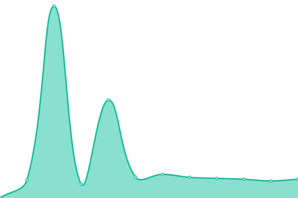
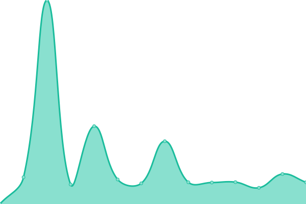
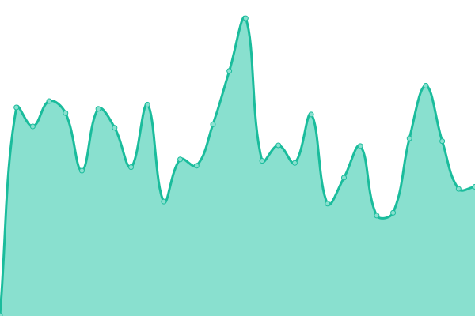

# [📈 Live Status](https://status.playt.net): <!--live status--> **🟧 Partial outage**

This repository contains the open-source uptime monitor and status page for [PLAYT.net](www.playt.net), powered by [Upptime](https://github.com/upptime/upptime).

With [Upptime](https://upptime.js.org), you can get your own unlimited and free uptime monitor and status page, powered entirely by a GitHub repository. We use [Issues](https://github.com/playt-net/uptime/issues) as incident reports, [Actions](https://github.com/playt-net/uptime/actions) as uptime monitors, and [Pages](https://status.playt.net) for the status page.

<!--start: status pages-->
<!-- This summary is generated by Upptime (https://github.com/upptime/upptime) -->
<!-- Do not edit this manually, your changes will be overwritten -->
<!-- prettier-ignore -->
| URL | Status | History | Response Time | Uptime |
| --- | ------ | ------- | ------------- | ------ |
|  [PLAYT.net](https://playt.net) | 🟩 Up | [playt-net.yml](https://github.com/playt-net/uptime/commits/HEAD/history/playt-net.yml) | 

 831ms
     
 | 

<a href="https://status.playt.net/history/playt-net">100.00%</a>
    

|  [Clash Paradise](https://clashparadise.io) | 🟩 Up | [clash-paradise.yml](https://github.com/playt-net/uptime/commits/HEAD/history/clash-paradise.yml) | 

 853ms
     
 | 

<a href="https://status.playt.net/history/clash-paradise">95.33%</a>
    

|  [Clash Paradise (www)](https://www.clashparadise.io) | 🟩 Up | [clash-paradise-www.yml](https://github.com/playt-net/uptime/commits/HEAD/history/clash-paradise-www.yml) | 

 776ms
     
 | 

<a href="https://status.playt.net/history/clash-paradise-www">95.55%</a>
    

|  [Database](https://clashparadise.io/api/admin/status/database) | 🟩 Up | [database.yml](https://github.com/playt-net/uptime/commits/HEAD/history/database.yml) | 

 368ms
     
 | 

<a href="https://status.playt.net/history/database">95.55%</a>
    

|  [Database (proxy)](https://clashparadise.io/api/admin/status/database-proxy) | 🟩 Up | [database-proxy.yml](https://github.com/playt-net/uptime/commits/HEAD/history/database-proxy.yml) | 

 460ms
     
 | 

<a href="https://status.playt.net/history/database-proxy">95.28%</a>
    

|  [Events](https://clashparadise.io/api/admin/status/events) | 🟩 Up | [events.yml](https://github.com/playt-net/uptime/commits/HEAD/history/events.yml) | 

 438ms
     
 | 

<a href="https://status.playt.net/history/events">95.71%</a>
    

|  [Compute](https://clashparadise.io/api/admin/status/compute) | 🟩 Up | [compute.yml](https://github.com/playt-net/uptime/commits/HEAD/history/compute.yml) | 

 474ms
     
 | 

<a href="https://status.playt.net/history/compute">95.84%</a>
    

|  [Email (primary)](https://clashparadise.io/api/admin/status/email_primary) | 🟩 Up | [email-primary.yml](https://github.com/playt-net/uptime/commits/HEAD/history/email-primary.yml) | 

 379ms
     
 | 

<a href="https://status.playt.net/history/email-primary">96.05%</a>
    

|  [Maintenance](https://clashparadise.io/api/admin/status/maintenance) | 🟩 Up | [maintenance.yml](https://github.com/playt-net/uptime/commits/HEAD/history/maintenance.yml) | 

 180ms
     
 | 

<a href="https://status.playt.net/history/maintenance">95.90%</a>
    

|  [Queues](https://clashparadise.io/api/admin/status/queues) | 🟩 Up | [queues.yml](https://github.com/playt-net/uptime/commits/HEAD/history/queues.yml) | 

 497ms
     
 | 

<a href="https://status.playt.net/history/queues">96.30%</a>
    

|  [DLQ](https://clashparadise.io/api/admin/status/dlq) | 🟩 Up | [dlq.yml](https://github.com/playt-net/uptime/commits/HEAD/history/dlq.yml) | 

 206ms
     
 | 

<a href="https://status.playt.net/history/dlq">93.73%</a>
    

|  [DLQ (staging)](https://staging.clashparadise.io/api/admin/status/dlq) | 🟩 Up | [dlq-staging.yml](https://github.com/playt-net/uptime/commits/HEAD/history/dlq-staging.yml) | 

 1902ms
     
 | 

<a href="https://status.playt.net/history/dlq-staging">96.55%</a>
    

|  [Clash Paradise (staging)](https://staging.clashparadise.io) | 🟥 Down | [clash-paradise-staging.yml](https://github.com/playt-net/uptime/commits/HEAD/history/clash-paradise-staging.yml) | 

 971ms
     
 | 

<a href="https://status.playt.net/history/clash-paradise-staging">77.04%</a>
    

|  [Trinity Swap](https://swap3.games.c.playt.net) | 🟩 Up | [trinity-swap.yml](https://github.com/playt-net/uptime/commits/HEAD/history/trinity-swap.yml) | 

 488ms
     
 | 

<a href="https://status.playt.net/history/trinity-swap">100.00%</a>
    

|  [Stack Jumper](https://stackgame.games.c.playt.net) | 🟩 Up | [stack-jumper.yml](https://github.com/playt-net/uptime/commits/HEAD/history/stack-jumper.yml) | 

 487ms
     
 | 

<a href="https://status.playt.net/history/stack-jumper">100.00%</a>
    

|  [Desert Racer](https://racer.games.c.playt.net) | 🟩 Up | [desert-racer.yml](https://github.com/playt-net/uptime/commits/HEAD/history/desert-racer.yml) | 

 479ms
     
 | 

<a href="https://status.playt.net/history/desert-racer">100.00%</a>
    

|  [Cupcaker](https://packager.games.c.playt.net) | 🟩 Up | [cupcaker.yml](https://github.com/playt-net/uptime/commits/HEAD/history/cupcaker.yml) | 

 500ms
     
 | 

<a href="https://status.playt.net/history/cupcaker">100.00%</a>
    

|  [Birdie Ball](https://minigolf.games.c.playt.net) | 🟩 Up | [birdie-ball.yml](https://github.com/playt-net/uptime/commits/HEAD/history/birdie-ball.yml) | 

 470ms
     
 | 

<a href="https://status.playt.net/history/birdie-ball">100.00%</a>
    

|  [Cube Machine](https://mewtrix.games.c.playt.net) | 🟩 Up | [cube-machine.yml](https://github.com/playt-net/uptime/commits/HEAD/history/cube-machine.yml) | 

 472ms
     
 | 

<a href="https://status.playt.net/history/cube-machine">100.00%</a>
    

|  [Beach Basher](https://gembasher.games.c.playt.net) | 🟩 Up | [beach-basher.yml](https://github.com/playt-net/uptime/commits/HEAD/history/beach-basher.yml) | 

 472ms
     
 | 

<a href="https://status.playt.net/history/beach-basher">100.00%</a>
    

|  [Cook Faster](https://cooking.games.c.playt.net) | 🟩 Up | [cook-faster.yml](https://github.com/playt-net/uptime/commits/HEAD/history/cook-faster.yml) | 

 484ms
     
 | 

<a href="https://status.playt.net/history/cook-faster">100.00%</a>
    

|  [Solitaire Jack](https://cardgame.games.c.playt.net) | 🟩 Up | [solitaire-jack.yml](https://github.com/playt-net/uptime/commits/HEAD/history/solitaire-jack.yml) | 

 489ms
     
 | 

<a href="https://status.playt.net/history/solitaire-jack">100.00%</a>
    

|  [Derby Classic](https://camel-race.games.c.playt.net) | 🟩 Up | [derby-classic.yml](https://github.com/playt-net/uptime/commits/HEAD/history/derby-classic.yml) | 

 477ms
     
 | 

<a href="https://status.playt.net/history/derby-classic">100.00%</a>
    

|  [Trinity Swap (staging)](https://swap3.games.c.playt.net) | 🟩 Up | [trinity-swap-staging.yml](https://github.com/playt-net/uptime/commits/HEAD/history/trinity-swap-staging.yml) | 

 415ms
     
 | 

<a href="https://status.playt.net/history/trinity-swap-staging">100.00%</a>
    

|  [Stack Jumper (staging)](https://stackgame.games.staging.c.playt.net) | 🟩 Up | [stack-jumper-staging.yml](https://github.com/playt-net/uptime/commits/HEAD/history/stack-jumper-staging.yml) | 

 475ms
     
 | 

<a href="https://status.playt.net/history/stack-jumper-staging">100.00%</a>
    

|  [Desert Racer (staging)](https://racer.games.staging.c.playt.net) | 🟩 Up | [desert-racer-staging.yml](https://github.com/playt-net/uptime/commits/HEAD/history/desert-racer-staging.yml) | 

 435ms
     
 | 

<a href="https://status.playt.net/history/desert-racer-staging">100.00%</a>
    

|  [Cupcaker (staging)](https://packager.games.staging.c.playt.net) | 🟩 Up | [cupcaker-staging.yml](https://github.com/playt-net/uptime/commits/HEAD/history/cupcaker-staging.yml) | 

 454ms
     
 | 

<a href="https://status.playt.net/history/cupcaker-staging">100.00%</a>
    

|  [Birdie Ball (staging)](https://minigolf.games.staging.c.playt.net) | 🟩 Up | [birdie-ball-staging.yml](https://github.com/playt-net/uptime/commits/HEAD/history/birdie-ball-staging.yml) | 

 439ms
     
 | 

<a href="https://status.playt.net/history/birdie-ball-staging">100.00%</a>
    

|  [Cube Machine (staging)](https://mewtrix.games.staging.c.playt.net) | 🟩 Up | [cube-machine-staging.yml](https://github.com/playt-net/uptime/commits/HEAD/history/cube-machine-staging.yml) | 

 452ms
     
 | 

<a href="https://status.playt.net/history/cube-machine-staging">100.00%</a>
    

|  [Beach Basher (staging)](https://gembasher.games.staging.c.playt.net) | 🟩 Up | [beach-basher-staging.yml](https://github.com/playt-net/uptime/commits/HEAD/history/beach-basher-staging.yml) | 

 474ms
     
 | 

<a href="https://status.playt.net/history/beach-basher-staging">100.00%</a>
    

|  [Cook Faster (staging)](https://cooking.games.staging.c.playt.net) | 🟩 Up | [cook-faster-staging.yml](https://github.com/playt-net/uptime/commits/HEAD/history/cook-faster-staging.yml) | 

 444ms
     
 | 

<a href="https://status.playt.net/history/cook-faster-staging">100.00%</a>
    

|  [Solitaire Jack (staging)](https://cardgame.games.staging.c.playt.net) | 🟩 Up | [solitaire-jack-staging.yml](https://github.com/playt-net/uptime/commits/HEAD/history/solitaire-jack-staging.yml) | 

 462ms
     
 | 

<a href="https://status.playt.net/history/solitaire-jack-staging">100.00%</a>
    

|  [Derby Classic (staging)](https://camel-race.games.staging.c.playt.net) | 🟩 Up | [derby-classic-staging.yml](https://github.com/playt-net/uptime/commits/HEAD/history/derby-classic-staging.yml) | 

 436ms
     
 | 

<a href="https://status.playt.net/history/derby-classic-staging">100.00%</a>
    

|  [Test Asset](https://cdy-staging-images.s3.fr-par.scw.cloud/6315c576a434b3c5d2a652cf/bannerKey) | 🟩 Up | [test-asset.yml](https://github.com/playt-net/uptime/commits/HEAD/history/test-asset.yml) | 

 1273ms
     
 | 

<a href="https://status.playt.net/history/test-asset">100.00%</a>
    

<!--end: status pages-->

[**Visit our status website →**](https://status.playt.net)

## 📄 License

- Powered by: [Upptime](https://github.com/upptime/upptime)
- Code: [MIT](./LICENSE) © [Anand Chowdhary](https://anandchowdhary.com), supported by [Pabio](https://pabio.com)
- Data in the `./history` directory: [Open Database License](https://opendatacommons.org/licenses/odbl/1-0/)
